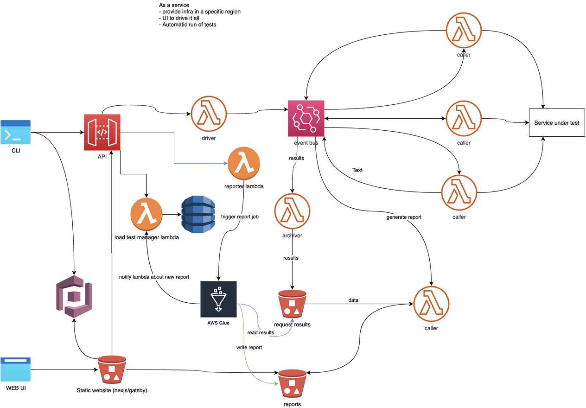

# Moggiez Design

## Architecture

### High level architecture

- Diagram (single-region)



- Breakdown
  - Driver triggers load testing events
  - Load testing tasks are performed by lambdas
  - Upon completion lambdas trigger events with task results
  - Kinesis Firehose dumps those events to S3
  - Reports are built on top of this data from S3
  - UI is used to vizualize reports and trigger load tests

# Developing

## Editor

- Install Draw.io for Desktop
  and/or
- Install Draw.io extension for VSCode

## Generating diagram image

- On OS X run:

```bash
make export_osx
```
